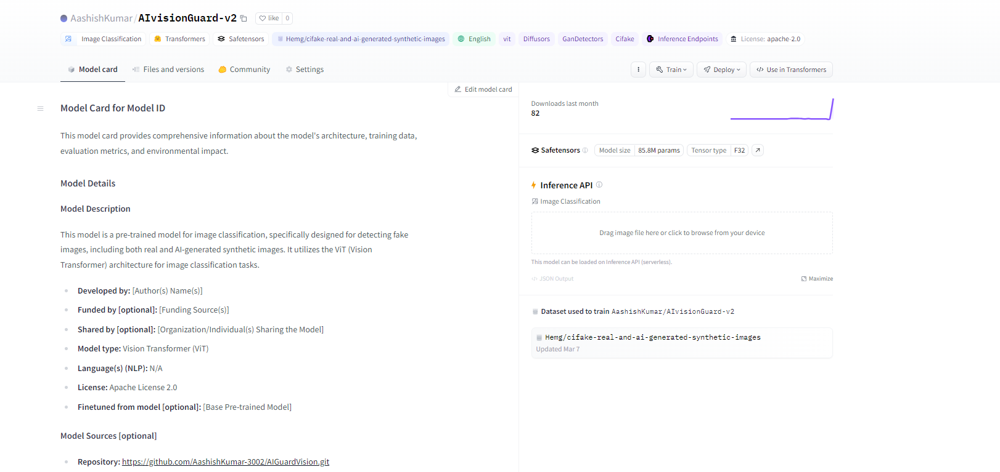

# AIGuardVision

AIGuardVision is an AI-powered solution designed to detect AI-generated images using state-of-the-art machine learning models. Our system leverages the power of Vision Transformers (ViT) to accurately classify images as real or synthetic.

## Features

- AI-generated image detection
- User-friendly interface for easy interaction
- Secure image storage and management
- Detailed classification reports with real and fake scores

## Getting Started

To get started with AIGuardVision, follow these steps:

1. Clone the repository:
```bash
git clone https://github.com/AashishKumar-3002/AIGuardVision.git
```

2. Install the required dependencies:
```bash
# Navigate to the project directory
cd AIGuardVision

# Install dependencies (assuming you have Python and pip installed)
pip install -r requirements.txt
```

3. Set up your environment variables:

- Create a .env file in the root directory.
- Add your Supabase URL and Key:
```
    SUPABASE_URL=your_supabase_url
    SUPABASE_KEY=your_supabase_key
```

4. Start the backend server:
```bash
# Navigate to the backend directory
cd backend

# Run the server
python app.py
```

5. Launch the UI:

- Open the ai_guard_vision_ui directory and follow the instructions in the 
  `README` to start the user interface.

## Usage

Once the system is up and running, you can upload images through the UI to check if they are real or AI-generated. The system will provide a classification type along with real and fake scores for each image.

## Contributing
We welcome contributions to AIGuardVision! If you have suggestions or improvements, please fork the repository and create a pull request, or open an issue with the tag "enhancement".

## License
This project is licensed under the MIT License - see the 
`LICENSE` file for details.

## Demo

Here are some screenshots demonstrating the functionality of AIGuardVision:




### TO test the hf model card, you can use the following link:
[Model Live](https://huggingface.co/AashishKumar/AIvisionGuard-v2)

